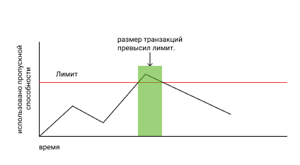
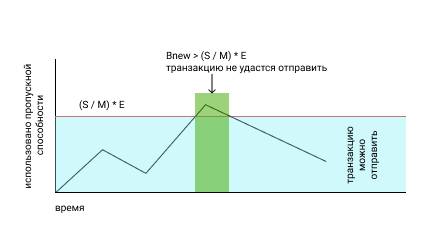

# Пропускная способность

## Определение

Пропускная способность — это максимальный размер транзакции в байтах, которую 
пользователь может отправить в блокчейн в данный момент времени. Объём пропускной 
способность зависит от количества [Shares](./economy.md#shares)  на счету у пользователя.

## Описание

Большинство блокчейн проектов заставляют пользователей платить за каждую операцию, чтобы ограничить спам и сделать его экономически невыгодным. Но VIZ не заставляет пользователей платить, он использует систему [динамичного частичного резервирования](#dynamic-reserve). При этой модели блокчейн автоматически подбирает коэффициент резервирования при разной нагрузке. Каждый раз, когда происходит всплеск активности, блокчейн резко понижает пропускную способность каждого аккаунта. Когда всплеск окончен, и в пропускном канале освободилось место, блокчейн медленно увеличивает пропускную способность каждого пользователя.

Каждый раз, когда пользователь подписывает транзакцию, она учитывается в его скользящей средней пропускной способности. Если скользящая пересекла лимит, то блокчейн не даст отправить эту транзакцию. В таком случае транзакцию надо отложить до тех пор, пока скользящая не опустится ниже порогового значения.

Так как информация от пользователя размещается в одном блоке, а не разбивается по нескольким, то невозможно увеличить время передачи данных, как это происходит в классических системах передачи информации (когда время передачи данных зависит от скорости пропускного канала), поэтому VIZ просто запрещает отправлять транзакцию. 

Получается, что пользователь не сразу испытывает неудобства, а сначала совершает операцию и потом сталкивается с проблемами. Также это значит, что пользователь не может увеличить скорость попадания транзакции в блокчейн, но может увеличить максимальный допустимый размер транзакции для своего аккаунта, если приобретёт дополнительную долю в сети.

Данную модель может быть непросто понять с первого раза. Давайте рассмотрим аналогию. 

Возьмём пустую банку. Её объём – это размер зарезервированной пропускной способности. Заполним банку наполовину водой – столько занимает одна транзакция. Теперь наденем на банку крышку с маленьким отверстием. Перевернём банку. Через некоторое время из неё вытечет половина воды. Перевернём банку обратно и снимем крышку. Нальём ещё воды объёмом, равным половине объёма банки. У нас осталось 1/4 свободного пространства. Теперь, если мы захотим налить ещё воды, объём которой равен половине объёма банки, нужно отлить не менее 1/4 объёма банки. Но мы не можем вылить этот объём сразу, для этого нам нужно надеть крышку с дыркой и перевернуть банку. Таким образом, можно сразу занять водой требуемый объём банки, но, чтобы освободить в ней ещё место, придётся ждать некоторое время. Так и с транзакциями. Можно быстро отправить транзакцию в блокчейн, но для отправки ещё одной, возможно, потребуется время.

## Чем отличается частичное резервирование от полного

Давайте представим, что в VIZ используется система полного резервирования. Это значит, что каждый пользователь может использовать часть пропускного канала пропорционально его доле в сети. Но невозможно использовать блокчейн в одно и то же время, кроме того, многим не нужно занимать весь выделенный пропускной канал. Следовательно, часть сети будет простаивать, и она не сможет реализовать весь свой потенциал.

При частичном резервировании каждый отдельный пользователь может использовать больше пропускной способности, когда в сети не происходят активные транзакции, и меньше во время пиковых нагрузок. В то же время блокчейн будет использовать полное резервирование при очень высоких нагрузках. Основная сложность такой модели состоит в выборе коэффициента резервирования при разной нагрузке. Если для полного резервирования можно выставить коэффициент, равный 1, то для других ситуаций может быть множество решений. В следующей главе описано, как работает распределение пропускной способности в VIZ.

## Как рассчитывается пропускная способность в VIZ

Перед тем, как читать дальше, обратите внимание на таблицу условных обозначений ниже.

| Условное обозначение | Единица измерения | Описание                                                     |
| -------------------- | ----------------- | ------------------------------------------------------------ |
| Bnew                 | байт              | Значение скользящей средней для пропускной способности, которое будет затрачено на данную транзакцию |
| Bold                 | байт              | Значение для скользящей средней уже затраченной пропускной способности |
| N                    | байт              | Размер новой транзакции                                      |
| W                    | секунды           | Количество секунд в неделе                                   |
| T                    | секунды           | Разница между временем, когда была отправлена последняя транзакция, и в данный момент |
| R                    | процент(%)        | Процент выделенной пропускной способности для аккаунтов с малой долей в сети. Этот параметр устанавливают делегаты |
| C                    | целое число       | Число активных аккаунтов (отправляли хотя бы одну транзакцию за 30 дней) с малой долей сети |
| Smax                 | Shares            | Объём доли конкретного аккаунта                              |
| S                    | Shares            | Объём доли конкретного аккаунта с учётом процента, выделенного для аккаунтов с малой долей сети. |
| M                    | Shares            | Объём доли всех аккаунтов                                    |
| G                    | байт              | Максимальный размер блока. Этот параметр устанавливается делегатами |
| K                    | целое число       | Коэффициент резервирования пропускной способности от 1 до 2000 |
| L                    | целое число       | Количество блоков, которое будет сгенерировано за неделю     |
| E                    | байт              | ``G * L * K`` – максимальная пропускная способность при данной нагрузке |

**Примечание: значение R устанавливают делегаты, они же определяют, какой объём доли считать малым. Кроме того, делегаты могут запретить участникам с малым объёмом доли совершать транзакции.**

Для каждого конкретного аккаунта устанавливается лимит пропускной способности ``(S / M) * Е``, то есть пропорционально его доле в сети. Причем, ``S = Smax * (100% - R)``, если ``Smax`` считается нормальной, и ``S = M * R / C`` для аккаунтов с малой долей. Это значит, что часть пропускной способности отнимается от аккаунтов с достаточным стеком  и распределяется среди аккаунтов с малой долей в сети. Если ``Bnew`` превысит зарезервированное значение, то аккаунт не сможет отправить новую транзакцию. В свою очередь, ``Bnew`` вычисляется по следующей формуле:

``Bnew = MAX(0, (W - T) * Bold / W) + N``.

Из формулы следует, что, чем больше времени прошло с последней транзакции, тем меньше будет ``Bnew,`` и, если последняя транзакция происходила семь дней назад, то ``MAX(0, (W - T) * Bold / W) = 0``, а ``Bnew = N``.

### Наценка на безграничные транзакции

Многие транзакции в VIZ ограничены в количестве информации, которую можно в них уместить. Например, при отправке перевода можно указать только количество токенов и заметку, размер которой не должен превышать 2 Кбайт. Но есть и другой тип транзакций, например, custom-транзакция, в которой основная информация может быть записана  её отправителем в вольной форме. Размер данных в таких транзакциях почти не ограничен.

На такие безграничные транзакции система может делать наценку на некоторый множитель ``X``([всё зависит от решения делегатов](./witnesses.md#data_operations_cost_additional_bandwidth)), тогда формула для ``Bnew`` будет иметь следующий вид:

``Bnew = MAX(0, (W - T) * Bold / W) + N * X``

## Как VIZ определяет коэффициент резервирования

Каждый раз, когда значение скользящего среднего размера блока больше, чем 25% от максимального размера блока ``G``, блокчейн уменьшает ``К`` в два раза. Когда нагрузка спадает, блокчейн снова увеличивает K, прибавляя единицу каждую минуту. Снижение ``K`` в два раза гарантирует, что аккаунты, которые использовали меньше 50% от предыдущей зарезервированной пропускной способности, не будут задеты, если нагрузку не вызвали держатели очень большого стека.

Формула расчета нового значения средней скользящей для размера блока:

``Anew = (99 * Aold + Q) / 100``

| Условное обозначение | Единица измерения | Описание                                                |
| -------------------- | ----------------- | ------------------------------------------------------- |
| Anew                 | байт              | Новое значение скользящей средней для размера блока     |
| Aold                 | байт              | Последнее значение скользящей средней для размера блока |
| Q                    | байт              | Размер нового блока                                     |

**Примечание: Если коэффициент резервирования постоянно падает ниже 100, то делегаты должны задуматься об увеличении пропускной способности сети, например, увеличив максимальный размер блока.**
